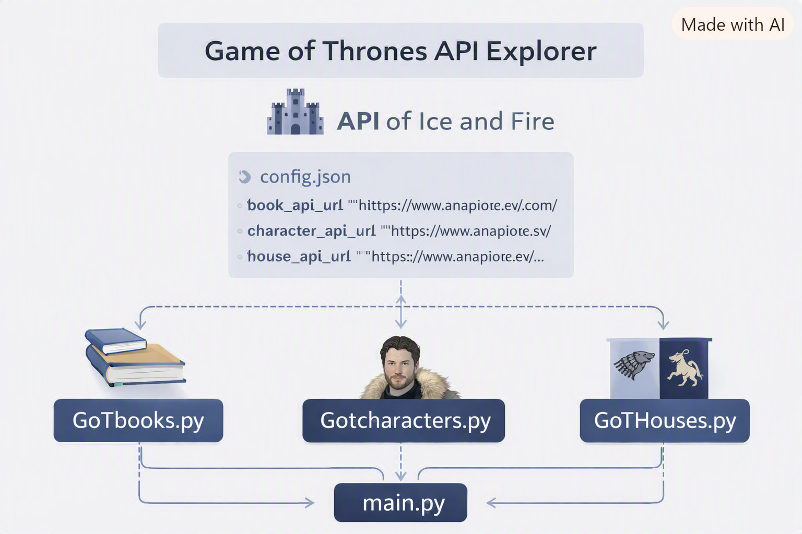

# 🐉 Game of Thrones API Explorer
Python • Requests • JSON • CLI Utilities — Educational Project

This repository contains a collection of Python scripts that interact with the An API of Ice and Fire, providing a simple command‑line interface for exploring books, characters, and houses from the Game of Thrones universe.

The project was created during Python training and demonstrates practical use of:
- HTTP requests
- JSON parsing
- modular scripting
- configuration files
- CLI‑based data exploration
  


It is a clean, beginner‑friendly example of how Python can consume external APIs and transform data into interactive utilities.

---

## Overview
The project includes multiple Python scripts that allow you to:
- list all Game of Thrones books
- explore characters and their details
- browse Westeros houses and their leaders
- fetch information dynamically from a public API
- run small interactive guessing games

All API endpoints are configurable through a config.json file.

---

## Repository Structure
```
requests/
│
├── main.py                         # Entry point (optional aggregator)
├── GoTbooks.py                     # Fetch and display GoT books
├── Gotcharacters.py                # Explore characters
├── GoThouses.py                    # Explore houses and leaders
├── get_info_about_character.py     # Detailed character lookup
│
├── config.json                     # API endpoints configuration
├── requirements.txt                # Python dependencies
└── README.md                       # Documentation
```

---

🔗 API Configuration
All scripts rely on a simple JSON configuration file:
```
{
    "book_api_url": "https://www.anapioficeandfire.com/api/books",
    "character_api_url": "https://www.anapioficeandfire.com/api/characters",
    "house_api_url": "https://www.anapioficeandfire.com/api/houses"
}
```
This makes the project flexible and easy to extend with new endpoints.

---

## Key Concepts Demonstrated
- HTTP requests using the requests library
- JSON parsing and data extraction
- Python scripting and modular code organization
- CLI utilities for interactive exploration
- Error handling for missing or incomplete API data
- Configuration management using config.json
- 
---
 
## How to Run
1. Clone the repository
```
git clone https://github.com/Lavinia-81/requests.git
cd requests
```
2. Install dependencies
```pip install -r requirements.txt```

3. Ensure *config.json* is present
If missing, create it using the example above.

4. Run any script
```
python GoTbooks.py
python Gotcharacters.py
python GoThouses.py
python get_info_about_character.py
```
Each script prints structured information directly in the terminal.

---

## Future Enhancements
- Add pagination support for large API datasets
- Add search filters (name, region, culture, etc.)
- Add a unified CLI menu (main.py)
- Add colorized terminal output
- Add caching for repeated API calls
- Add unit tests for API responses

---

## Purpose of This Project
This project was created during Python training to practice:
- consuming REST APIs
- working with JSON
- building small CLI tools
- organizing Python scripts cleanly
- understanding external data structures

It is a great foundation for more advanced Python automation, data processing, or API‑driven applications.

---

## Contributions
Contributions are welcome.
Feel free to open an issue or submit a pull request.
